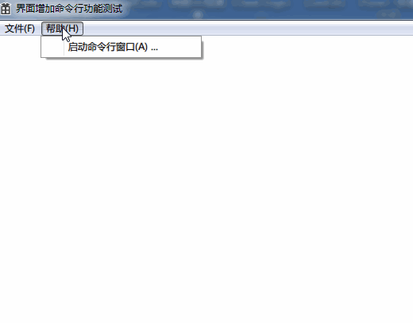

# GUICreateCommandLine
GUI界面程序中启动**命令行窗口**，

比如你希望在 你的程序中增加 调试功能，点击“调试”，就会弹出一个命令行窗口.



## 用途
方便的创建命令行窗口在有界面的程序中。

- 涉及文件:
```
Thread.h
ConsoleManager.h
DebugConsole.h
```

你只需要覆写`DebugConsole`文件即可.

代码中已经给出例子,在“帮忙”中启动“启动命令行窗口”即可。

使用方法：
```
DebugConsole* CM = new DebugConsole()//创建命令行窗口,并开始工作
delete(CM)//关闭
```

## GUI中启动命令行的难点
- 分析命令
- 响应Ctrl+C等中断
- 禁止命令行的关闭按钮
否则会导致进程退出


## 由来

一年多前我遇到了很多问题.那时我最终是使用图形界面模拟命令窗口实现的.

此中疑难,一直在我心中萦绕,最终了解更多深入的原理.也伴随着我逐渐退出以逆向为业的生活.

本项目大幅参考了ProcessHacker项目的开源代码.

End.
2018年12月17日

